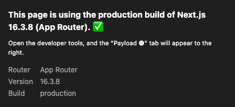
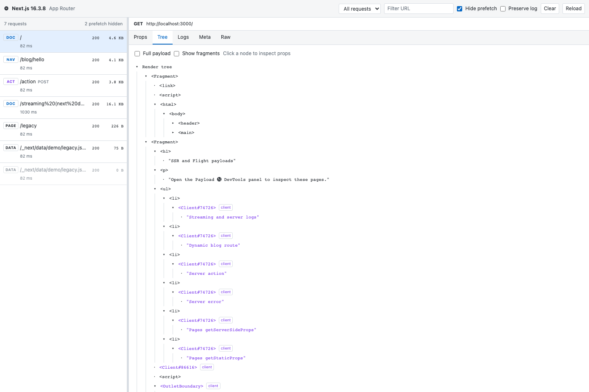
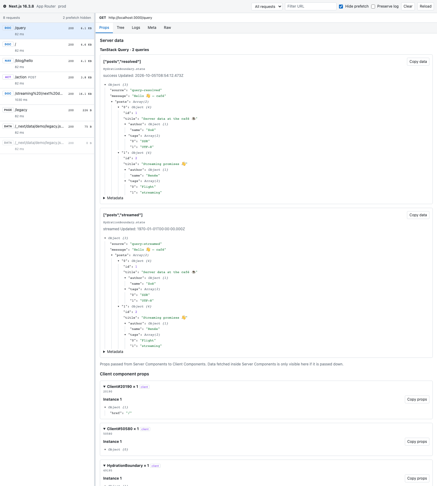
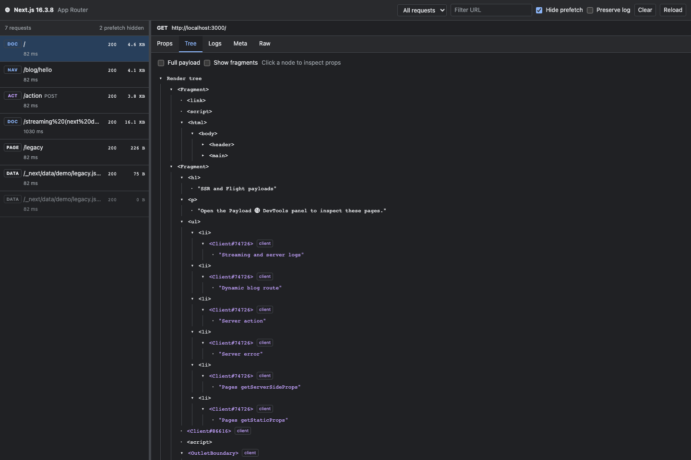
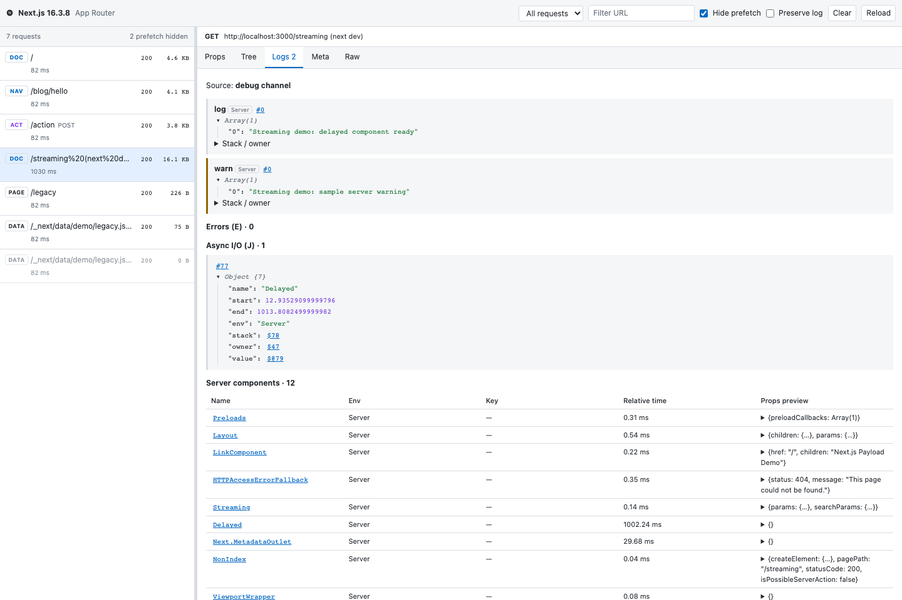
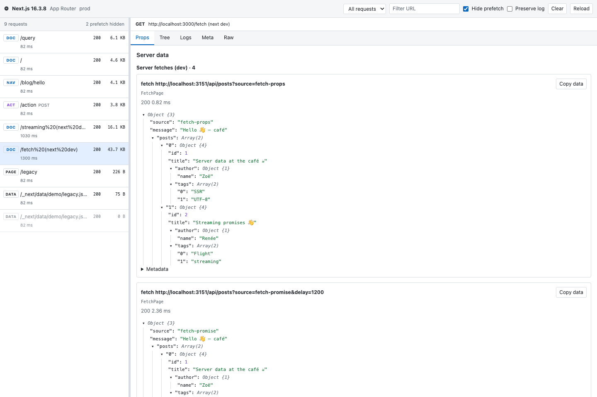
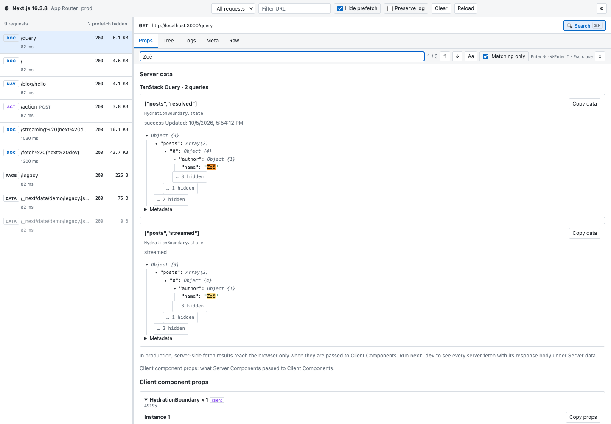
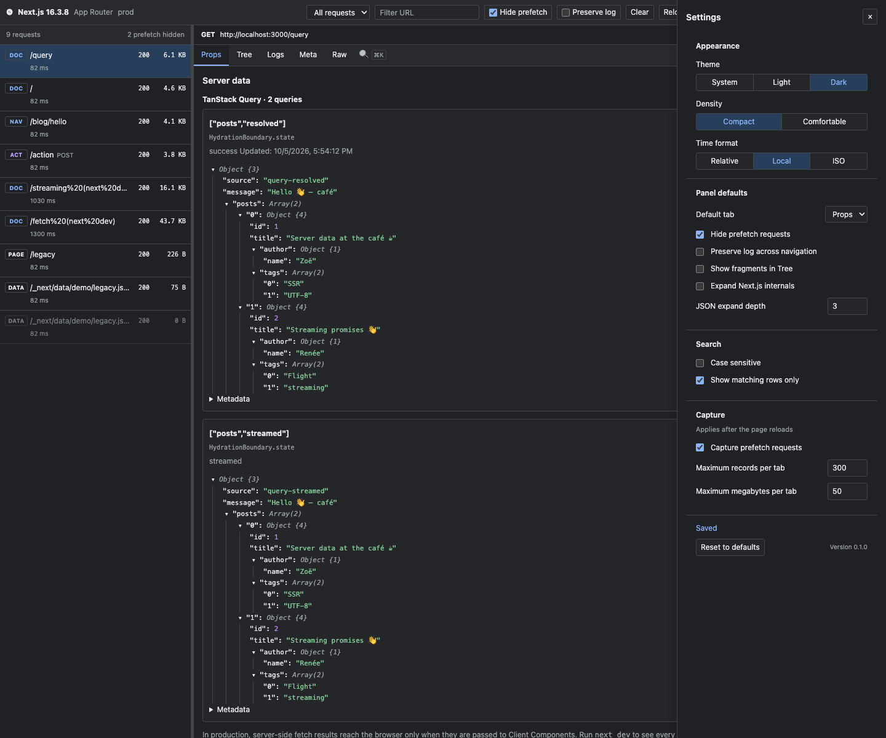

# 🅝 Next.js Developer Tools

A Chrome MV3 extension for inspecting Next.js SSR and RSC (Flight) payloads. On Next.js pages, the toolbar icon turns from gray to black; click it to see the router, version and build mode. The **Payload 🅝** DevTools panel shows render trees, client props, route metadata, server logs, and raw payloads.

## Install

Use Node.js 24 and pnpm 12.9.1.

```sh
npm install -g pnpm@12.9.1
pnpm install
pnpm build
```

Open `chrome://extensions` in Chrome, enable **Developer mode → Load unpacked**, and select `apps/extension/dist`. Reload a Next.js page, then open the **Payload 🅝** DevTools tab. After changing the source, reload both the extension and the inspected page.

## Toolbar popup

Click the pinned icon to see whether the active page uses Next.js, its router and version, and whether the build is development or production. The popup also shows the build ID when available. Open DevTools for **Payload 🅝**; App Router records use Props, Tree, Logs, Meta, and Raw, while Pages Router records use Props, Meta, and Raw. Props shows data serialized for client components or `pageProps`.



## Demo

```sh
pnpm demo       # Development mode, http://localhost:3000
pnpm demo:prod  # Build and start in production mode
```

`/` demonstrates Counter props, `/blog/hello` client navigation, `/action` server actions, and `/streaming` streaming and development server logs. `/legacy` and `/static` demonstrate Pages Router data. `/query` and `/legacy-query` show TanStack Query hydration, `/swr` shows SWR fallback, and `/fetch` compares client props, streamed promises, and server-only rendering against the local `/api/posts` endpoint.

## Screenshots

The preview uses real payloads captured from the demo.

| Render tree | Client props |
| --- | --- |
|  |  |
|  |  |

Build the preview with `pnpm --filter @nextjs-devtools/extension build:preview`, then open `apps/extension/dist/panel-preview.html` through a local HTTP server. The normal build excludes the preview.

## Layout

```text
apps/extension/         MV3 extension, React panel, unit tests, and tests/e2e
apps/demo/              Next.js 16 demo (App + Pages Router)
packages/flight-parser/ Pure TypeScript Flight parser with no external dependencies
```

## Commands

| Command | Description |
| --- | --- |
| `pnpm build` | Build the extension → `apps/extension/dist` |
| `pnpm dev` | Rebuild when extension source changes |
| `pnpm demo` / `pnpm demo:prod` | Development / production demo |
| `pnpm lint` / `pnpm lint:fix` | Check / fix with Biome |
| `pnpm typecheck` | Typecheck all packages |
| `pnpm test` | Parser, runtime, and panel state Vitest tests |
| `pnpm test:e2e` | Preview build + prod/dev demos + Chromium E2E |
| `pnpm icons` | Generate PNG icons |

## E2E

Install Playwright's bundled Chromium, then run:

```sh
pnpm --filter @nextjs-devtools/extension exec playwright install chromium
pnpm test:e2e
```

`apps/extension/tests/e2e/` checks the toolbar icon state, captures, server actions, live server logs, and the panel preview. Ports `3210` and `3211` must be available. Failure traces are saved to `apps/extension/test-results/e2e` and the HTML report to `apps/extension/playwright-report`. CI runs unit checks and E2E in separate jobs.

For a manual check, run `pnpm demo`, load the extension, navigate to `/streaming`, and inspect server logs in DevTools **Payload 🅝 → Logs**.

## Server data

The main goal of the panel is to show the responses the Next.js server received. The **Props** tab starts with a fully expanded **Server data** section:

| Source | Where it comes from | Mode |
|---|---|---|
| **Server fetches** | Every `fetch` awaited in a Server Component: URL, status, headers, timing and the parsed body from `res.json()` / `res.text()`. This includes fetches used only for rendering, which never reach a Client Component. | `next dev` only |
| TanStack Query | `<HydrationBoundary state>` (App) or `pageProps.dehydratedState` / `trpcState` (Pages), one card per query incl. streamed pending queries | dev + prod |
| SWR | `<SWRConfig value={{ fallback }}>` or `pageProps.fallback` | dev + prod |
| Apollo / Redux / urql | Next.js example conventions (`__APOLLO_STATE__`, `initialReduxState`, `urqlState`, …) | dev + prod |
| Streamed promises | Promises passed to Client Components and read with `use()` | dev + prod |



In production, data fetched on the server reaches the browser only when it is passed to Client Components (it then also appears in the client props below). Server fetches come from React's development debug info (the Next.js 16 debug channel), so run `next dev` to see them. React may omit very deep values because of its serialization limits.

## Search

Press **Cmd+K** on macOS or **Ctrl+K** on Windows/Linux (or click the **🔍 Search ⌘K** button at the top right of the detail pane) to search the tab you are on; press it again to close: Props, Tree, Logs, Meta or Raw.

| Tab | Searches |
|---|---|
| Props | Server data cards, client component props, `pageProps` |
| Tree | Element and component labels, node props |
| Logs | Server console arguments, errors, async I/O, server components |
| Meta | Next.js fields, route tree, request fields and HTTP headers |
| Raw | Flight rows (Rows) or the raw text (Text) |

Matches inside collapsed trees expand automatically. Enter / Shift+Enter (or Cmd/Ctrl+G) move between matches, **Aa** (⌥C / Alt+C) toggles match case, and **Matching only** hides everything that does not lead to a match (`… N hidden` reveals it). The query survives tab and record switches. Escape closes the search bar without toggling the DevTools console.

**Cmd/Ctrl+F** opens DevTools' built-in search, which drives the same search in the current tab.



## Settings

Open **⚙ Settings** in the panel to choose a theme, density, timestamp format, and panel and search defaults. Appearance changes apply immediately and settings sync across the panel and extension options page. Capture settings control prefetch recording and buffer limits and apply after the inspected page reloads. The toolbar popup also links to Settings.

See the [settings E2E tests](apps/extension/tests/e2e/settings.spec.ts).



## How capture works

The page's MAIN world hook observes `__next_f` pushes, copies of RSC fetch responses, `__NEXT_DATA__`, and the Next.js 16 development WebSocket debug channel. The ISOLATED world bridge keeps bytes in the tab and sends a snapshot and new chunks when the panel connects. The parser interprets references as display values without executing them; main and debug streams are parsed separately and merged. No data leaves the browser.

## Limitations

- Only data serialized from the server to the client is visible. Full server-side database or external API responses cannot be inspected.
- Server logs are available in development mode. The extension does not read Next.js 16 IndexedDB debug data for cache restores; reload if logs are missing.
- Main and debug data share a 10MB limit per record, with 300 records / 50MB per tab. Older records are evicted, and truncated data is marked `truncated`.
- Reload the page after loading the extension to capture the initial document. Only the top frame is observed.
- Flight is an internal protocol and may vary between Next.js and React versions. Coverage uses a real Next.js 16 demo and minimal Next.js 14 and 15 fixtures.
